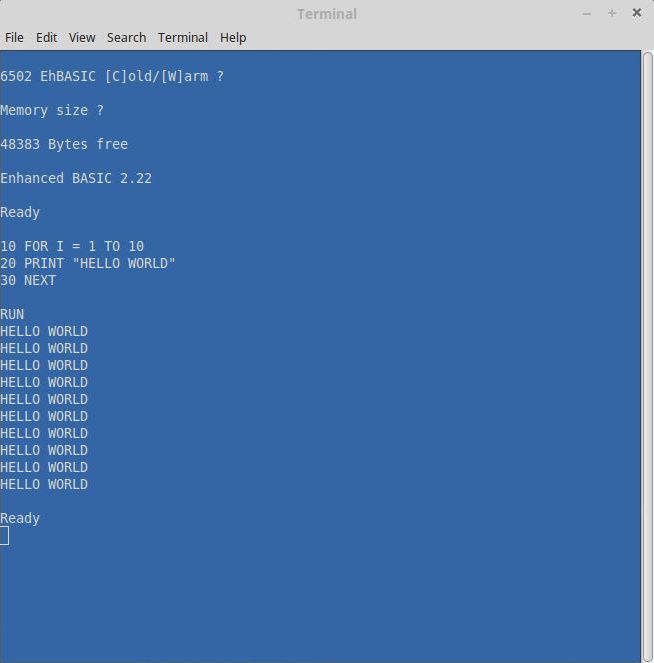

# retro6502 - Emulate a 6502 (and run Basic) in Rust

## Overview

retro6502 is a MOS 6502 emulator written in Rust. It has a simple memory mapped I/O facility that lets 6502 assembly programs (including Basic) interact with a console window.

## Why?

Does the world need another 6502 emulator?

Consider:

* 6502s are still being produced, it's not a dead language
* It's fun to write an emulator for a simpler processor
* It's a good way to explore a new language (Rust)
* It can serve as a platform to explore other areas (compilers, VMs, etc)
* When was the last time you coded and debugged assembly?
* Your own reasons here...

## Features

* Supports the original 6502 instruction set
* Supports Decimal Mode
* Passes Klaus Dormann's functional test
* Integrated disassembler and monitor
* Simple memory-mapped I/O for console window (ncurses-based)
* Runs Enhanced Basic (turn your terminal into a retro PC!)

## Building

1. You need to have Rust installed - see the [Rust Web Site](https://www.rust-lang.org/index.html) for latest info on installing Rust.

2. You also need to have ncurses 5.x linkable libs on your machine (libncurses5-dev or libncurses5w-dev). Please use the appropriate package manager on your system, e.g.,
```
sudo apt-get install libncurses5-dev
```
For Mac OSX, you will need to use `brew` to install the ncurses libs.

3. Once the ncurses libs are available, you can build the term6502 application with:
```
cargo build
```

## Testing

Basic unit tests (not comprehensive) can be run with:
```
cargo test
```

You can download a comprehensive test suite from the following location:
[Functional Tests](https://github.com/Klaus2m5/6502_65C02_functional_tests)

Run the tests in monitor mode with the following command line:

```
cargo run -- -m -s 400 6502_functional_test.bin
```

Then set a breakpoint for the success location, and issue a go command.  E.g.:

```
(s)tep (g)o (r)eg (m)em [addr] (p)c [addr] (b)p [addr] e(x)it : b 3399

(s)tep (g)o (r)eg (m)em [addr] (p)c [addr] (b)p [addr] e(x)it : g
```

Once the test completes, you should be stopped at the breakpoint with the console showing:
```
* $3399 JMP $3399
  $339C JMP $0400
  $339F PHP

```

## Usage

The basic usage and options are outlined below (also available with the --help flag).

The three main options are `-d` (disassembly), `-m` (monitor), and `-e` (execute). Disaasembly produces the disassembled output for a given binary file. Monitor mode is primarily for debugging. The Execute mode is for running the program with the emulated I/O in the console window.

```
USAGE:
    retro6502 [FLAGS] [OPTIONS] <FILENAME>

FLAGS:
    -d, --disasemble    Disassemble the specified binary
    -e, --execute       Execute the specified binary
    -h, --help          Prints help information
    -m, --monitor       Debug the specified binary in monitor mode (Default)
    -V, --version       Prints version information

OPTIONS:
    -l, --load_addr <ADDRESS>     Address to load input file at (hexadecimal,
                                  e.g: FE02)
    -r, --read_addr <ADDRESS>     Address for I/O read at (hexadecimal, e.g:
                                  FE02)
    -s, --start_addr <ADDRESS>    Start address for Program Counter
                                  (hexadecimal, e.g: FE02)
    -w, --write_addr <ADDRESS>    Address for I/O write (hexadecimal, e.g:
                                  FE02)

ARGS:
    <FILENAME>    The binary file to use

```

## Running Basic

Here are the steps to run Enhanced Basic 2.2:

1. Download the Basic source and assemble it as per the instructions here: Alternatively, you can get a pre-assembled binary here: [Basic Download](http://codegolf.stackexchange.com/questions/12844/emulate-a-mos-6502-cpu)
2. Run retro6502 with a command to load the binary, and specify the I/O memory locations.

For example:
```
cargo run -- -e -l c000 -s ff80 -w f001 -r f004 ehbasic.bin
```

This loads and executes the Basic binary at address $C000, and jumps to a reset vector at $FF80. It also specifies an I/O read location at $F004, and an I/O write location at $F001. This command does not start in Monitor mode - instead it executes the program directly.



## References

Some good references on the 6502 CPU and instruction set:
* [Easy 6502](http://skilldrick.github.io/easy6502/)
* [6502.org](http://www.6502.org/tutorials/6502opcodes.html)
* [6502 Opcodes](http://www.llx.com/~nparker/a2/opcodes.html)
* [Opcode details](http://nesdev.com/6502.txt)

## Author(s)

Salim Alam

## License

Source code is released under the Apache 2.0 license as follows:

Copyright 2016 Salim Alam

Licensed under the Apache License, Version 2.0 (the "License");
you may not use this file except in compliance with the License.
You may obtain a copy of the License at

    http://www.apache.org/licenses/LICENSE-2.0

Unless required by applicable law or agreed to in writing, software
distributed under the License is distributed on an "AS IS" BASIS,
WITHOUT WARRANTIES OR CONDITIONS OF ANY KIND, either express or implied.
See the License for the specific language governing permissions and
limitations under the License.
